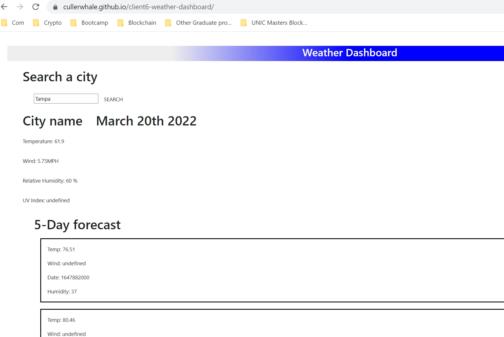

# Weather Dashboard
Our sixth client requested a weather dashboard that pulls API information and saves to local storage.  

Here is a link to the github repository: https://github.com/CullerWhale/client6-weather-dashboard

 Here is a screenshot and link for the deployed application: https://cullerwhale.github.io/client6-weather-dashboard/

